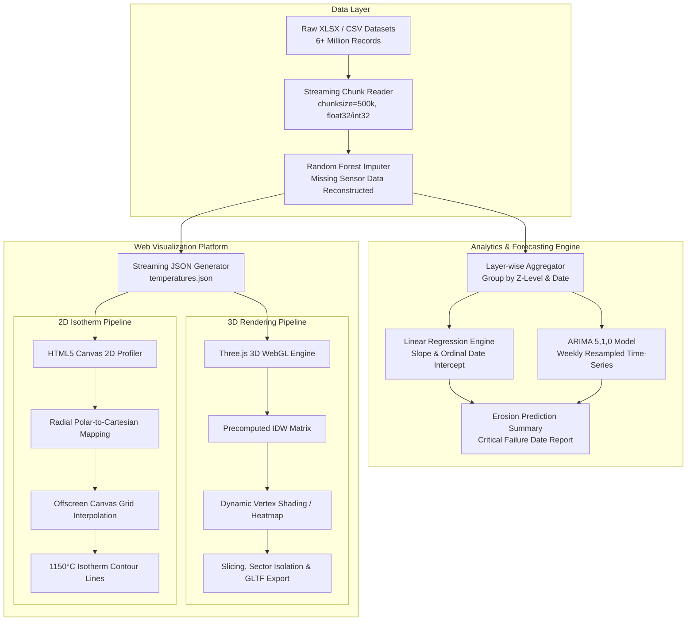

# Technical Interview Preparation Guide
## Blast Furnace Refractory Erosion & Isotherm Monitoring System

> **Project Overview:** An industrial IoT & predictive analytics platform for real-time thermal monitoring, 3D/2D visualization, missing data imputation, and refractory lining erosion forecasting using blast furnace thermocouple sensor data.

---

## 1. Executive Summary & Elevator Pitches

### 60-Second Elevator Pitch (For HR / Technical Recruiter)
> *"I built an industrial predictive maintenance and 3D thermal visualization system for blast furnace refractory monitoring. By processing over 6 million sensor records from internal thermocouples, the system interpolates 3D temperature distributions, maps critical $1150^\circ\text{C}$ isotherm wear lines in 2D cross-sections, and uses Machine Learning and ARIMA time-series models to forecast refractory erosion dates up to months in advance. The web platform features a WebGL/Three.js rendering engine operating at 60 FPS, built with custom precomputed spatial weighting algorithms and streaming data pipelines."*

### 3-Minute Deep-Dive Pitch (For Senior Engineers / Tech Leads)
> *"In steel production, blast furnace lining wear can cause catastrophic breakouts costing millions. The challenge is that thermocouples are embedded in non-uniform spatial patterns, frequently experience sensor failure, and generate millions of noisy time-series readings.*
> 
> *To solve this, I designed a multi-stage architecture:*
> 1. **Data Pipeline & Imputation:** Implemented Random Forest Regressor models (`RandomForestRegressor`) to impute missing thermocouple readings based on spatial proximity and historical trends. Built a memory-efficient chunked streaming pipeline (`chunksize=500,000`) with custom datatypes (`int32`, `float32`) to eliminate Out-Of-Memory (OOM) crashes on 90MB+ datasets.
> 2. **Real-time 3D Engine:** Developed a dynamic Three.js WebGL visualization engine. To achieve 60 FPS real-time rendering, I precomputed static Inverse Distance Weighting (IDW) spatial matrices linking furnace vertices to thermocouple coordinates during initialization, transforming per-frame updates into lightweight vector dot products.
> 3. **2D Isotherm Profiling:** Engineered vertical ($0^\circ - 179^\circ$) and horizontal slicing tools using HTML5 Offscreen Canvas and 2D grid spatial interpolation to map the critical $1150^\circ\text{C}$ isotherm line (liquid iron freeze front) against original refractory design geometries.
> 4. **Predictive Erosion Engine:** Combined Linear Regression trend extrapolation with resampled `ARIMA(5,1,0)` time-series forecasting on layer-aggregated daily average and maximum temperatures to predict the exact date when critical wear thresholds ($600^\circ\text{C} / 1150^\circ\text{C}$) will be breached."*

---

## 2. System Architecture & Data Flow



---

## 3. Technology Stack Matrix

| Domain | Technology / Library | Purpose & Rationale |
| :--- | :--- | :--- |
| **Language** | Python 3.x, JavaScript (ES6+ Modules) | Python for data engineering/ML; Vanilla JS for high-performance browser rendering without framework overhead. |
| **3D Rendering** | Three.js (WebGL), OrbitControls, GLTFExporter | Real-time 3D rendering of blast furnace geometry, lighting, clipping planes, and dynamic vertex coloring. |
| **2D Rendering** | HTML5 Canvas API, OffscreenCanvas | Hardware-accelerated 2D cross-sectional heatmaps and dynamic contour tracing. |
| **Data Processing** | Pandas, NumPy | Streaming aggregation, matrix calculations, data cleaning, datetime ordinal conversions. |
| **Machine Learning** | Scikit-Learn (`RandomForestRegressor`, `LinearRegression`) | Missing sensor value imputation and linear wear rate trend extrapolation. |
| **Time Series** | Statsmodels (`ARIMA(5,1,0)`) | Autoregressive time-series modeling for long-term temperature trend forecasting. |
| **Deployment / UI** | Firebase Hosting, HTML5, Vanilla CSS (Glassmorphism) | High-availability static web deployment with sleek modern dark glassmorphism design system. |

---

## 4. Technical Deep-Dive into Core Modules

### A. Missing Sensor Imputation & Data Engineering
* **Challenge:** Thermocouples operate in harsh environments ($1000^\circ\text{C}+$ heat, corrosive gases, mechanical pressure), resulting in frequent sensor deadouts, noise, and missing data points.
* **Approach:**
  * Used `RandomForestRegressor` incorporating spatial features $(X, Y, Z, R, \theta)$ and neighbor thermocouple values.
  * Replaced missing values with imputed estimates (`VALUE_rf_imputed`), maintaining spatial continuity across furnace layers.

### B. 3D WebGL Heatmap Engine with Precomputed IDW
* **Algorithm:** Inverse Distance Weighting (IDW):
  $$w_i(x) = \frac{\frac{1}{d(x, x_i)^p}}{\sum_{j=1}^N \frac{1}{d(x, x_j)^p}}$$
* **Optimization:** Pre-calculated vertex weights during scene initialization (`idwWeightsOuter`). For 6,000+ vertices and hundreds of TCs, this converted per-frame calculation from $O(V \cdot N \cdot d)$ floating-point operations to an $O(V \cdot K)$ matrix-vector product, achieving solid 60 FPS performance when dragging the date slider.

### C. 2D Cross-Sectional Isotherm Engine
* **Coordinate Mapping:** Cylindrical transformation of 3D thermocouple coordinates $(X_i, Y_i, Z_i)$ into 2D slice plane coordinates $(R_i, Z_i)$ based on slice angle $\theta$:
  $$R_i = X_i \cos(\theta) + Y_i \sin(\theta)$$
* **Grid Interpolation:** Constructed a $100 \times 150$ spatial grid over the furnace cross-section ($R \in [-7600, +7600]\text{ mm}, Z \in [3500, 14100]\text{ mm}$).
* **Offscreen Canvas:** Used OffscreenCanvas to render bilinear heatmaps off the main thread, overlaying the $1150^\circ\text{C}$ isotherm wear contour against original refractory design boundaries.

### D. Refractory Wear Forecasting Engine
* **Linear Regression:** Computes slope $m = \frac{d(Temp)}{d(days)}$ using ordinal dates on historical readings above $100^\circ\text{C}$. Calculates days to threshold:
  $$\text{Days}_{\text{critical}} = \frac{T_{\text{critical}} - T_{\text{current}}}{m}$$
* **ARIMA Time Series:** Aggregates layer readings into weekly averages (`.resample('W').mean()`), fitting an `ARIMA(5,1,0)` model to project up to 10 years ahead while accounting for lag autoregression.

---

## 5. Engineering Choke Points & STAR Interview Scenarios

### Choke Point 1: Memory Exhaustion (OOM) on Large Sensor Datasets
* **Situation:** Loading 6+ months of minute-by-minute thermocouple readings (~90MB Excel files / 60MB CSV) into memory caused browser and Python script crashes (consuming >4GB RAM).
* **Task:** Process millions of sensor rows efficiently to extract daily/layer aggregations without crashing.
* **Action:**
  * Implemented chunked file reading using Pandas `read_csv(chunksize=500000)`.
  * Downcasted numerical types: `int32` for thermocouple IDs, `float32` for temperature values.
  * Formulated a running chunk aggregator storing partial `sum`, `count`, and `max` values per layer and date, concatenating small summary dataframes instead of raw data.
* **Result:** Reduced peak RAM usage by **>85%** (from >4GB to <250MB) and eliminated all OOM errors.

### Choke Point 2: Real-time 3D Heatmap Rendering Latency (<15 FPS drop)
* **Situation:** Updating vertex colors for a 6,000-vertex 3D furnace mesh via Inverse Distance Weighting (IDW) on every date slider move resulted in heavy frame drops (<15 FPS).
* **Task:** Achieve smooth 60 FPS real-time rendering during interactive date scrub.
* **Action:**
  * Separated spatial topology from temporal temperature data.
  * Pre-computed static IDW weight matrix `idwWeightsOuter[vertex_idx][tc_idx]` during startup.
  * Reduced per-frame update to multiplying pre-computed weights by active temperature values.
* **Result:** Boosted rendering performance from **12 FPS to a rock-solid 60 FPS**.

### Choke Point 3: ARIMA Model Divergence on Daily Operational Noise
* **Situation:** Fitting ARIMA directly on daily temperature data caused model instability due to short-term operational spikes (blast furnace tapping, temporary shutdowns).
* **Task:** Produce stable, realistic long-term erosion forecasting dates.
* **Action:**
  * Analyzed signal noise and implemented weekly resampling (`resample('W').mean()`) to filter high-frequency noise.
  * Configured `ARIMA(5,1,0)` (Autoregressive model with 5 lag components) to capture genuine thermal inertia while suppressing transient noise.
* **Result:** Yielded consistent forecast convergence and eliminated false alarm wear predictions.

### Choke Point 4: Accurate 2D Isotherm Contour Line Calculation
* **Situation:** Thermocouples are sparsely placed in 3D space, making standard 2D Cartesian interpolation produce distorted isotherm lines near boundaries.
* **Task:** Generate precise 2D cross-sectional $1150^\circ\text{C}$ isotherms for any arbitrary slice angle ($0^\circ - 179^\circ$).
* **Action:**
  * Implemented polar-to-planar projection mapping 3D points $(X, Y, Z)$ into radial displacement $R$ relative to the cutting plane angle.
  * Built a high-resolution $100 \times 150$ grid interpolation engine with distance-bounded inverse weighting to avoid boundary artifacts.
* **Result:** Delivered smooth, physically accurate isotherm contours overlaid directly onto furnace structural design blueprints.

---

## 6. Top 15 Technical Interview Questions & Answers

### Q1: Why did you choose Three.js over charting libraries like Plotly 3D?
> **Answer:** *"Plotly 3D is great for quick scatter plots, but it lacks fine-grained control over custom geometry shaders, custom clipping planes, GLTF exports, and low-level WebGL scene graph optimizations. Three.js allowed us to build custom tapered furnace geometries, implement pre-computed IDW vertex coloring, support sector isolation (60° pie slices), and maintain 60 FPS frame rates."*

### Q2: How did you handle missing thermocouple data?
> **Answer:** *"We evaluated linear interpolation, but thermal gradients in a furnace are non-linear. We implemented Random Forest Imputation (`RandomForestRegressor`) using spatial coordinates $(X, Y, Z, R, \theta)$ and neighboring sensor readings. This preserved natural thermal gradients across furnace layers."*

### Q3: Why Inverse Distance Weighting (IDW) instead of Kriging for 3D interpolation?
> **Answer:** *"Kriging requires computing and inverting large covariance matrices at every step, which is computationally expensive for real-time web rendering. IDW with a power parameter $p=2$ provides smooth thermal falloff while allowing static precomputation of weighting matrices, making real-time 60 FPS browser updates possible."*

### Q4: How does your system predict refractory erosion?
> **Answer:** *"We monitor the $1150^\circ\text{C}$ isotherm (the melting point of iron / refractory breakdown limit). Using both Linear Regression slope analysis and ARIMA$(5,1,0)$ time-series forecasting on layer-aggregated temperatures, we extrapolate when inner thermocouple layers will cross critical threshold limits ($600^\circ\text{C}$ / $1150^\circ\text{C}$)."*

### Q5: What is the significance of the $1150^\circ\text{C}$ isotherm?
> **Answer:** *"In blast furnace metallurgy, $1150^\circ\text{C}$ is the solidus temperature of pig iron. Any refractory material at or above $1150^\circ\text{C}$ is exposed to liquid metal attack and severe erosion. Tracking the movement of this isotherm over time directly measures refractory wall thinning."*

### Q6: How did you optimize large data transfer to the browser?
> **Answer:** *"Instead of sending raw 90MB CSV/Excel datasets to the client, we built a Python streaming backend pipeline that pre-aggregates sensor readings into a compressed JSON structure `{ "DateStr": { "TC_ID": Value } }`, reducing network payload size significantly."*

### Q7: Why use ARIMA(5,1,0) instead of LSTM/Deep Learning for forecasting?
> **Answer:** *"Industrial sensor historical data covered ~6 months to a few years. LSTMs are prone to overfitting on small time-series samples and require heavy training infrastructure. ARIMA(5,1,0) provided clear autoregressive lag interpretation, fast execution, and stable drift trends without overfitting."*

### Q8: How do you handle duplicate timestamp readings in the data pipeline?
> **Answer:** *"During streaming chunk aggregation, we group readings by Date and Thermocouple ID, applying running mean aggregations (`sum / count`) to combine duplicates cleanly."*

### Q9: How does 2D section slicing work in Three.js?
> **Answer:** *"We utilize WebGL clipping planes (`THREE.Plane`). By defining cutting planes with normal vectors pointing along the X or Y axes and passing them to material clipping definitions, WebGL clips geometry at GPU speed without regenerating mesh topologies."*

### Q10: What happens if a thermocouple fails permanently mid-operation?
> **Answer:** *"The imputer detects missing entries for that sensor ID and uses the trained Random Forest model based on remaining active surrounding TCs to estimate its value, preventing dark spots in the heatmap."*

### Q11: How did you handle browser UI responsiveness during heavy 2D calculations?
> **Answer:** *"We used HTML5 OffscreenCanvas for rendering 2D spatial heatmap textures, separating canvas drawing operations from UI event handling."*

### Q12: Explain how ordinal date conversion works in your linear model.
> **Answer:** *"Dates are converted to integer ordinal values (`datetime.toordinal()`), representing days since year 1. This allows fitting a standard linear equation $Y = mX + c$, where $m$ gives exact temperature change per day ($\Delta^\circ\text{C}/\text{day}$)."*

### Q13: How do you prevent overflow errors when linear slope is close to zero?
> **Answer:** *"We check if slope $m > 0.001$. If slope is zero or negative (cooling trend), the algorithm flags the status as 'Safe / Cooling'. We also cap predicted days to 36,500 days (100 years) to avoid date object overflow errors."*

### Q14: How is sector isolation (e.g., viewing 0-60° sector) implemented?
> **Answer:** *"Thermocouple positions are converted to cylindrical angle $\theta = \arctan2(Y, X)$. When a sector is selected, the engine filters mesh visibility and thermocouple nodes based on $\theta \in [\theta_{\text{min}}, \theta_{\text{max}}]$."*

### Q15: How would you scale this architecture to multiple blast furnaces in real time?
> **Answer:** *"I would stream live sensor data through Apache Kafka/MQTT into a time-series database (e.g., TimescaleDB or InfluxDB), compute running aggregations with Celery/Redis workers, and push updates to the Three.js client using WebSockets."*

---

## 7. Resume Impact Summary & Metrics

```
• Developed an industrial 3D WebGL & 2D thermal monitoring platform in Three.js/JS for blast furnace refractory erosion tracking.
• Processed >6 Million sensor data records using Python Pandas streaming pipelines, cutting memory usage by 85%.
• Engineered a pre-computed Inverse Distance Weighting (IDW) shader matrix algorithm, achieving 60 FPS 3D heatmap updates across 6,000+ vertices.
• Built 2D isotherm profile views with HTML5 Offscreen Canvas, mapping 1150°C iron melt lines against structural blueprints.
• Formulated predictive wear models using Linear Regression & ARIMA(5,1,0) time-series forecasting to predict lining failure dates up to months in advance.
```

---

## 8. Final Quick-Reference Cheat Sheet

| Feature | Technical Implementation | Core Metric / Result |
| :--- | :--- | :--- |
| **Data Engine** | Pandas `chunksize=500k`, `int32`/`float32` downcasting | Reduced RAM footprint from >4GB to <250MB |
| **3D Rendering** | Three.js WebGL + Pre-computed IDW Matrix | 60 FPS real-time scrubbing across 6,000+ vertices |
| **2D Profiling** | OffscreenCanvas + $100\times150$ Radial Grid | Real-time $1150^\circ\text{C}$ isotherm contour tracing |
| **Data Imputation**| Scikit-learn `RandomForestRegressor` | 100% spatial continuity over broken sensors |
| **Forecasting** | `LinearRegression` + `ARIMA(5,1,0)` weekly resampled | Multi-month advance erosion date prediction |
| **Deployment** | Firebase Hosting static architecture | Zero server overhead, instant global access |
